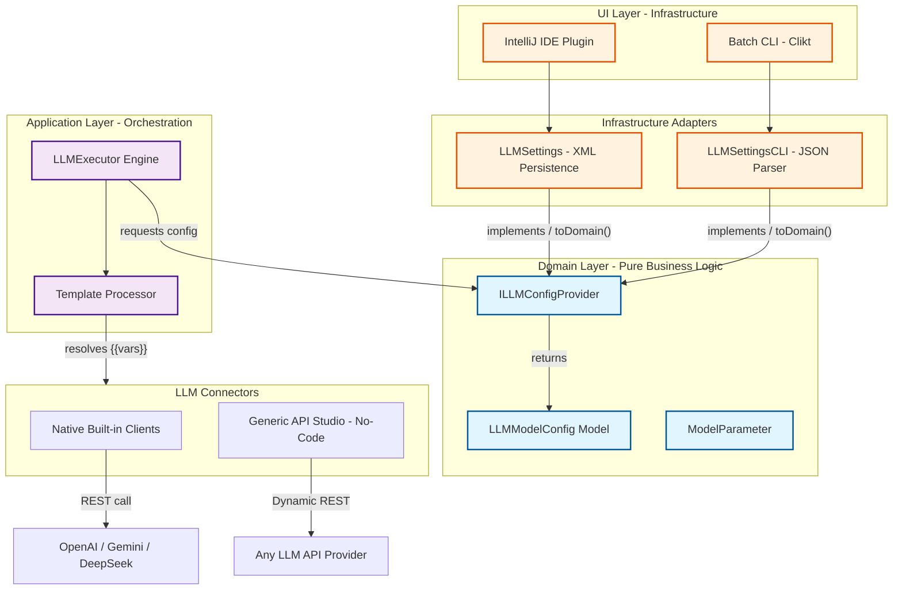

# BDDTestGen Architecture Overview

This diagram represents the modernized architecture of BDDTestGen, following Clean Architecture principles with a focus on the **Generic API Studio (No-Code)** integration.

### Component Details

*   **Domain Layer**: Pure business logic and contracts. Agnostic to IntelliJ or CLI.
*   **Infrastructure Adapters**: Logic to persist and read configurations (XML for IDE, JSON for CLI).
*   **Template Processor**: Scans request templates for `{{placeholder}}` patterns, enabling auto-discovery of UI variables.
*   **Generic API Studio**: A declarative connector that eliminates the need for external scripts. It handles dynamic URL construction, JSON payload generation, and Smart Authentication (header vs query param logic).
*   **Connectors**: Standardized interfaces for communicating with LLM providers using modern `java.net.http.HttpClient`.

### Key Benefits
1. **Zero-Config Execution**: No local Python or scripts required.
2. **Auto-Discovery**: UI fields are generated automatically from API templates.
3. **Portability**: The same configuration works in both the IDE and the CLI.