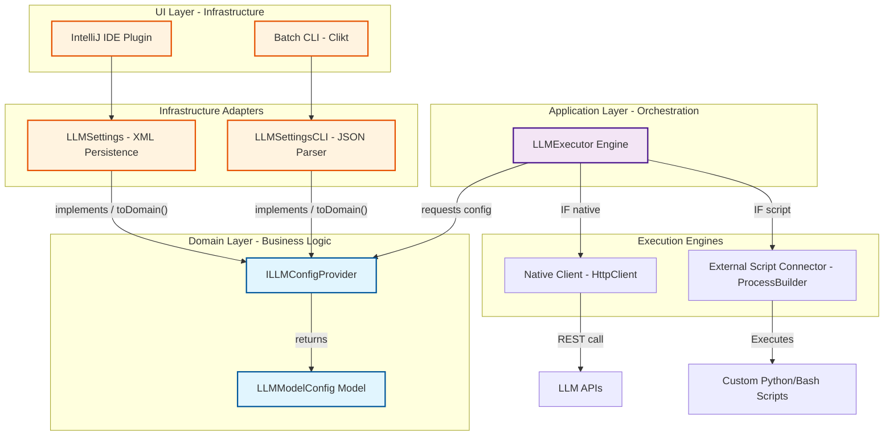

# BDDTestGen Architecture Overview

This diagram represents the modernized architecture of BDDTestGen, following Clean Architecture principles with a clear separation between Domain, Application, and Infrastructure layers.

### Component Details

*   **Domain Layer**: Pure business logic and contracts.
*   **Infrastructure Adapters**: Logic to persist and read configurations (XML for IDE, JSON for CLI).
*   **Application Layer (LLMExecutor)**: Orchestrates the generation process, deciding between the Native Kotlin engine or the External Script Connector for custom integrations.
*   **External Interaction**: Native calls via `HttpClient` ensure zero-dependency execution for standard models.